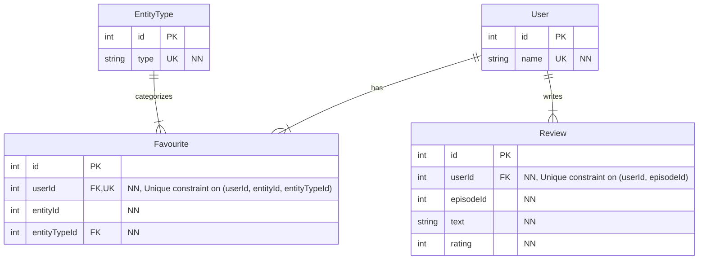
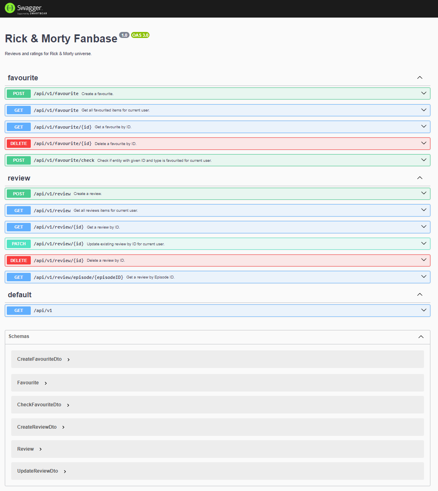

# Rick & Morty - Fanbase

## Description

This simple CRUD REST application, based on generated [NestJS started plate](https://docs.nestjs.com/first-steps#setup), is a brief demonstration of TypeScript
and NestJS skills, coveringv following requirements:

Simple CRUD service exposing REST endpoints to:

1. Favourite characters, locations, & episodes.
2. Review and rate episodes.
   1. Include text.
   2. Star rating (1-5).
3. Create open API definition for your schema (OAS3).
4. Write unit tests and show coverage report.

## Installation

```bash
$ npm install
```

## Running the app

```bash
# Development.
$ npm run start

# Watch mode.
$ npm run start:dev

# Production mode.
$ npm run start:prod

# Initialize the database with seed data (only needed once).
$ npm run seed
```

Main REST API Endpoints:

- http://localhost:3000/api/v1/favourite
- http://localhost:3000/api/v1/review

See [Swagger UI](http://localhost:3000/api) for details on all endpoints and operations.

## Data

For local development purposes, the app is backed by SQLite database in `data/database.db`.

To initialize the databse with seed data run `npm run seed`.

### Entity relations



## Test

```bash
# unit tests
$ npm run test

# e2e tests
$ npm run test:e2e

# test coverage
$ npm run test:cov
```

## License

Nest is [MIT licensed](LICENSE).

## Screenshots


